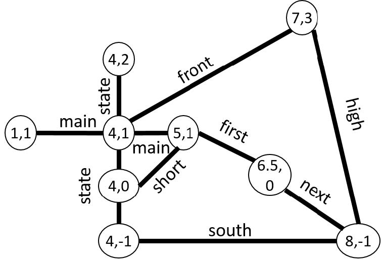

\fontsize{10}{12}

```{r libraryLoad, echo=FALSE, cache=FALSE, results='hide', warning=FALSE, message=FALSE}
library(knitr); library(dplyr); library(xtable); library(knitr); library(ggplot2); library(Cairo);
library(xlsx); suppressPackageStartupMessages(library(googleVis)); library(ctv);library(digest)

# Document environment 
setwd("E:\\Brendan\\Documents\\Education\\UnivColoBoulder\\DBessentials\\Assignments\\Week02")
curDir <- getwd()
fileList <- dir()
environment <- sessionInfo()
write(fileList, file = 'fileList.txt')
writeLines(unlist(lapply(environment, paste, collapse=" ")),
           con = 'environment.txt', sep = "\n", useBytes = FALSE)
```


## Executive Summary
Work is summarized that demonstrates heuristic-based reduction of distance traveled by traversing an arbritrary circuit in a weighted graph. A java code template is provided by UC San Diego faculty. The skeleton code is comprised of 262 files in 51 directories. Development excutes with Java JDK 1.8.0_60-b27 in an Eclipse Version: Mars.1 Release (4.5.1) environment. Version control executes with git version 1.9.5.msygit.0. After the decision-based heuristic is successfully implemented along with implementing several search algoithms, the code is 273 files with 51 directories. Code development for the heuristic decision-based routing method includes the addition of four methods in **MapGraph.java** of the package *roadgraph*.

## Project Summary
The project delivers (1) geographic routing between start and destination locations and (2) visualization of the graph nodes visited during execution of several search algoithms. The code demonstrates class design that implements five constructs: (1) Abstract Data Type (ADT), (2) Breadth First Search (BFS), (3) Dijkstra Search, (4) $A^*$ Search, and (5) decision-based heuristic for returning shortest distance recorded for a subset of route permutations.  The ADT is a graph that stores data using a [HashMap](http://docs.oracle.com/javase/8/docs/api/java/util/HashMap.html). Geographic location data is stored in an object that is named GeographicPoint (GP) and that extends the [Object.Number.Double](http://docs.oracle.com/javase/7/docs/api/java/lang/Double.html) class. Routes and visited nodes are visualized using the [Google Map API](https://www.google.com/work/mapsearth/products/mapsapi.html). The heuristic decision based extension returns route optimization to the console.

## Introduction
A graph is a construction that contains nodes and edges. Nodes are objects that contain data, and edges represent directed connections between nodes.  In the context of geographic map data, a GP represents a node and roads represent edges connecting these nodes. Developed code is in ```MapGraph.java```, ```mapVertex.java```, and ```mapEdge.java``` classes of the ```roadgraph``` package. Figure 1 shows an UML diagram for five of the seven classes in ```roadgraph``` package.  The remaining two classes are shown in figure 2.


The methods implementing the heuristic decision-based reduction of distance traveled is described in the section **Methods**.  The implemented search algorithms and related methods for the classes ```MapGraph.java```, ```mapVertex.java```, and ```mapEdge.java``` also are described in the **Methods** section.


## Methods

The pseudocode for BFS algorithm is:
```
bfs(start, destination, Consumer<GP>):
Initialization of structures
Enqueue GP in queue and add to list of visited GP's
while queue is not empty:
    dequeue GP from front of queue as current
    if current == destination, then return parent map
    for each of current's unvisited neighbors, n:
        add n to visited set
        add current as n's parent in parent map
        enqueue n to back of queue
if parent map not returned, then there is no path
```
Consumer\<GP\> is a hook that passes nodes visited during BFS search to the class that provides a visual representation of the visited nodes.

The pseudocode for Dijkstra Search algoithm is:
```
dijkstra(GeographicPoint start, 
    		GeographicPoint goal, Consumer<GeographicPoint> nodeSearched))
    Initialize: Priority queue (PQ), visited HashSet, parent HashMap, and distances to infinity
    Enqueue {S, 0} into PQ
    while PQ is not empty:
        dequeue node curr from front of queue
        if (curr is not visited)
        add curr to visited set
        If curr == goal return parent map
        for each of curr's neighbors, n, not in visited set:
            if path through curr to n is shorter
                update curr as n's parent in parent map
                enqueue {n, distance} into the PQ
    reaching this line implies there is no path
```

The pseudocde for $A^*$ Search algorithm is:
```
aStarSearch(GeographicPoint start, 
    		GeographicPoint goal, Consumer<GeographicPoint> nodeSearched)
    Initialize: Priority queue (PQ), visited HashSet, parent HashMap, and distances to infinity
    Enqueue {S, 0} into PQ
    while PQ is not empty:
        dequeue node curr from front of queue
        if (curr is not visited)
        add curr to visited set
        If curr == goal return parent map
        for each of curr's neighbors, n, not in visited set:
            if (path through curr to n + the geographic distance to goal) is shorter
                update curr as n's parent in parent map
                enqueue {n, distance} into the PQ
    reaching this line implies there is no path
```

The heuristic for decision-based reduction of total distance traveled while traversing a selected cycle of GPs uses $A^*$ Search and Two-Opt Swap.  $A^*$ Search is used to determine shortest distance between any adjacent pair GPs. $A^*$ Search is selected relative to Dijkstra Search to reduce the number of nodes searched. In $A^*$ search, the distance used for setting priority underestimates actual travel distance. Therefore, a separate method is used for returning traversal distance of the routing path returned by $A^*$ search. Finally, [Two-Opt Swapping](https://en.wikipedia.org/wiki/2-opt) algorithm is implemented for selecting a subset of permutations of the routing circuit. Finally, the routing circuit with smallest distance traveled is returned to the console.

The pseudocode for Two-Opt is [3]:

```   
implementTwoOptSwap(List<GeographicPoint>, i, k)
    {
       1. take List[1] to List[i-1] and add them in order to new_route
       2. take List[i] to List[k] and add them in reverse order to new_route
       3. take List[k+1] to end and add them in order to new_route
       return new_route;
    }
```

### Class: MapGraph
BFS is implemented in the class MapGraph.java, for which some skeleton code is provided. Modifications made to MapGraph include:

+ **MapGraph()** is modified to an empty contructor that instantiates a HashMap for the ADT of this Java application. The HashMap object stores a GP as a key with a list of mapVertex() objects for its value. Definition of mapVertex() is deferred.
+ **getNumVertices() : int** is modified to return the number of vertices contained within an instantiated MapGraph(). The return value is used for debug and test.
+ **getVertices() : Set\<GeographicPoint\>** is modified to return the key set of the ADT HashMap. Membership in the key set is used as a conditional in BFS.
+ **getNumEdges() : int** is modified to return the number of edges that connect each GP. The return value is used for debug and test.
+ **addVertex(GeographicPoint) : boolean**  is modified to determine whether a proposed GP satisfies a specification and, if true, then calls the method implementAddVertex().
+ **implementAddVertex(GeographicPoint) : void** is a **new method** that adds the GP to the MapGraph/HashMap key set. This method calls mapVertex(); description deferred.
+ **addEdge(GeographicPoint, GeographicPoint, String, String, double) : void** is modified to determine whether a proposed edge satisfies specification and, if true, then calls the method implementAddVertex().
+ **implementAddEdge(GeographicPoint, GeographicPoint, String, String, double) : void** is a **new method** that adds the edge to the MapGraph/HashMap. This method calls setters/getters in mapEdge().
+ **bfs(GeographicPoint, GeographicPoint) : List\<GeographicPoint\>** is unmodified. This method is used for testing BFS in the console.
+ **bfs(GeographicPoint, GeographicPoint, Consumer\<GeographicPoint\>) : List\<GeographicPoint\>** is modified to implement BFS. The method validates whether the the provided GP's are valid and, if true, then returns a list of GP's in reverse order that connect the start and destination GP's.
+ **buildRouteList(HashMap\<GeographicPoint, GeographicPoint\>, GeographicPoint, GeographicPoint) : List\<GeographicPoint\>** is a **new method** that returns a route in *travel-order* from start GP to destination GP and is called on successful completion of either BFS, Dijkstra, or aStarSearch algorithms.
+ **dijkstra(GeographicPoint, GeographicPoint) : List\<GeographicPoint\>** is unmodified. This method is used for testing Dikstra search in the console.
+ **dijkstra(GeographicPoint, GeographicPoint, Consumer\<GeographicPoint\>) : List\<GeographicPoint\>** is modified to implement the Dijkstra search algorithm.  The method validates whether the the provided GP's are valid and, if true, then returns a list of GP's in reverse order that connect the start and destination GP's weighted for shortest distance.
+ **aStarSearch(GeographicPoint, GeographicPoint) : List\<GeographicPoint\>** is unmodified. This method is used for testing a* search in the console.
+ **aStarSearch(GeographicPoint, GeographicPoint, Consumer\<GeographicPoint\>) : List\<GeographicPoint\>** is modified to implement the aStarSearch algorithm.  The method validates whether the the provided GP's are valid and, if true, then returns a list of GP's in reverse order that connect the start and destination GP's weighted for shortest distance while eliminating nodes that unreasonable increase distance.
+ **printMapGraph(MapGraph) : void** is a **new overloaded method** that prints out the MapGraph()/HashMap() ADT for debug and test.
+ **printMapGraph(HashMap\<GeographicPoint, GeographicPoint\>) : void** is a **new overloaded method** that prints out the reverse order list of GP's that were visited during BFS.
+ **printMapGraph(List<GeographicPoint> route) : void**  is a **new overloaded method** that prints out GPs that are contained in a list.
+ **main(String[]) : void** is a method modified to test operations of MapGraph.java class within the console.
+ **greedyCycle(List<GeographicPoint>) : List<GeographicPoint>** is a method for returning the shortest past between adjacent pairs of GPs in a list.
+ **distanceCycleRoute(List<GeographicPoint>) : double** is a method that returns the total traversed distance (by edge) for a path input as a list.
+ **twoOptSwap(List<GeographicPoint>) : List<GeographicPoint>** is a method that determines the size of the swappable subset of a cycle of GPs.
+ **implementTwoOptSwap(List<GeographicPoint>, int, int) : List<GeographicPoint>** is a method that returns a path GPs as specified by the Two-Opt algorithm.
 
### Class name: mapVertex

The class mapVertex represents a GP as a node.  The mapVertex node also contains a list of mapEdge()'s that represent roads that connect a GP to other GP's in the MapGraph(). Data are private, so getter/setter methods are used to pass data to and from a mapVertex() instance. Figure 2 lists the setter/getter methods.

+ **mapVertex(GeographicPoint) : mapVertex** constructs the node object of the graph.
+ **setLocation(GeographicPoint) : void** is a setter for the GP location of mapVertex.
+ **getLocation() : GeographicPoint** is a getter that returns the GP location of mapVertex.
+ **setMapEdge() : void** is a setter for generating an empty array list of edges for mapVertex.
+ **setMapEdge(mapEdge) : void** is a setter for adding an edge to an array list of edges associated with  mapVertex.
+ **getMapEdge() : List<mapEdge>** is a getter that returns the array list of edges for mapVertex.
+ **setStartRoute(GeographicPoint) : void** is a setter for the global start location for a search algorithm that uses mapVertex.
+ **getStartRoute() : GeographicPoint** is a getter that returns the global start location for a search algorithm that uses mapVertex..
+ **setDistanceEdgeCumFromStart() : double.POSITIVE_INFINITY** is a setter for the initial priority of mapVertex for weighted search algorithms.
+ **setDistanceEdgeCumFromStart(double) : double** is a setter for updated priority of mapVertex for weighted search algorithms.
+ **getDistanceEdgeCumFromStart() : double** is a getter that returns the distance of mapVertex from the global start by traversing map edges.
+ **setDistanceGeoFromStart() : double** is a setter for the geographic distance of mapVertex from the global start location.
+ **getDistanceGeoFromStart() : double** is a getter for the geographic distance of mapVertex from the global start location.
+ **compareTo(Object) : int** is a method that establishes a comaparison of priorities of the nodes that are in priority queues.

### Class name: mapEdge
The class mapEdge is a graph edge that represents roads connecting GP's. The graph is a di-Graph; therefore, an instance of mapEdge() contains a start node and an end node.  The mapEdge object also contains other geographic data: street name, distance between the start and end GP's, and type of road. Data are private, so getter/setter methods pass data to and from a mapEdge() instance. Figure 2 lists the setter/getter methods.

+ **mapEdge(GeographicPoint, GeographicPoint, String, String, double) : mapEdge** constructs the mapEdge object.
+ **setStart(GeographicPoint) : void** is a setter for the start GP of an edge.
+ **getStart() : GeographicPoint** is a getter for the start GP of an edge.
+ **setEnd(GeographicPoint) : void** is a setter for the end GP of an edge.
+ **getEnd() : GeographicPoint** is a getter for the end GP of an edge.
+ **setStreetname(String) : void** is a setter for the street name of an edge.
+ **getStreetname() : String** is a getter for the street name of an edge.
+ **setRoadType(String) : void** is a setter for the category of a street for an edge.
+ **getoadType() : String** is a getter for the category of a street for an edge.
+ **setDistance(double) : void** is a setter for the length (km) edge.
+ **getDistance() : double** is a getter for the the length (km) an edge.
+ **toString() : String** is a method that formats information of mapEdge for printing in string format.

### Class Design: Overall Design Justification
The class design for the ADT leverages the classes ```mapVertex.java```, and ```mapEdge.java``` to contruct node objects and edge objects.  These objects are loaded as values into the HashMap of ```mapGraph.java```. Whenever possible, variables and methods are defined as ```private```. This provides an abstraction layer between user and data. The BFS method also is comprised of two methods--bfs() and buildRouteList(). The bfs() executes BFS that returns an intermediary list of routing nodes. The buildRouteList() transforms the intermediary list of routing nodes to a final list of nodes of the route in travel-order. Modularity provides robustness and flexibility. For example, the addition of Dijkstra Search and $A^*$ Search algorithms requires only the addition of the methods specified by the pseudocode shown in the **Methods** section. The ADT and route publishing by buildRouteList() is unaffected by implementing additional search algorithms.

## Results
Figure 3 shows the BFS deliverable--a route between two geographic locations traversing the fewest number of vertices.  A [video clip](https://youtu.be/jvZqHP5YdI8) demonstrates execution of the project. The clip shows a route between start and destionation GP's and provides a visualization of GP's visited during BFS. The video clip also includes a cartoon of BFS generated using a [visualization tool](http://qiao.github.io/PathFinding.js/visual/) made available by [Xueqiao (Joe) Xu](https://github.com/qiao).  The cartoon is drawn representing the Google map of intersections feaatured in the video clip. The classes ```MapGraph.java```, ```mapVertex.java```, and ```mapEdge.java``` are available on request by contacting the corresponding author.

 (Waltham, MA).](./assets/img/BrandeisRoute.PNG)

Figure 4 shows results of the heuristic decision-based determination of shortest route. Seven vertices were selected for testing and are shown in Figure 5. The decision-based heuristic tracks the shortest distance returned from the subset of route permutations. The final return is the shortest distance returned and its associated route.





## Conclusions
Class design, an ADT, BFS, Dijkstra Search, and $A^*$ Search were successfully implemented and demonstrated as a Java application that provides routing between two geographic locations using the Google Maps API. The implemented class design provides flexibility, modularity, and robustness.  For example, different search algorithms can be implemented with the existing ADT with only modest changes to the ```roadgraph``` package. Finally, demonstration of a decision-based heuristic for determing the routing with the shortest distance from a subset of permutations is successful. The decision-based heuristic implemented $A^*$ Search and Two-Opt Swap with results returned to the console.


## Acknowledgements
The author gratefully acknowledges the pedagogy of C Alvarado, M Minnes, and L Porter. This report is generated via [OpenSource](http://opensource.org/) using [MarkDown](http://daringfireball.net/projects/markdown/) and [R](https://cran.r-project.org/) x64 3.1.2 within [RStudio](https://www.rstudio.com/) Version 0.98.1102 environment.

## References

1. [Java Documentation](https://docs.oracle.com/javase/8/docs/api/overview-summary.html)
2. [Stack Overflow](https://stackoverflow.com/)
3. [Two-Opt](https://en.wikipedia.org/wiki/2-opt)